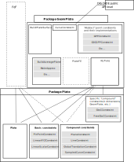

## About : Extensions and improvements of Plate algorithm

The development of FDF, Toyota requirements for G2 continuity of H-prism, as well as the limitations of STYLER Powerfill and Powermorph actions have, for seemingly quite different demands, lead to improve Plate with the possibility to impose linear constraint that are different from the value of it's function derivative.

This "new version" of Plate make accessible spectaculary improvements in PowerFill (this has been tested, only user interface is left to be developped) and presumably same kind of improvements in PowerMorph
Furthermore it will have to be integrated in the Package GeomPlate, to allow enriched public syntaxes as much for "Shell Design" projet than for CAS.CADE clients.

You will find attached the internal specification document corresponding to these improvements and extensions.

Moreover, integration of this development in CAS.CADE is the subject of the study n° S 3816 opened by the Software Development Direction


# improvements and Extensions of Plate 
The development of FDF, Toyota requirements for G2 continuity of H-prism, as well as the limitations of STYLER Powerfill and Powermorph actions have, for seemingly quite different demands, lead to improve Plate with the possibility to impose linear constraint that are different from the value of it's function derivative.

This document describe extensions brought in this context.
The design of these improvements is as much coming from recent demands than maturation of ideas resulting in more than 2 years of utilisation of Plate in various contexts.

Moreover, strategies of iterative computation, which constitutes a research domain and certain improvements in the case of PlateFE (Plate is based on finite element method, which will be the topic of another document) can, even if it is less obvious (and less mathematically justifiable) be tested with Plate. The improvements in this domain should allow to share concepts and code between the two tools Plate and PlateFE.

Finally, the public level of CAS.CADE API about surface creation by filling and interpolation is the package GeomPlate, developped by the modelisation team.
This document propose an alternative positioning of differents classes that works together in the Plate and GeomPlate package.

Integration of this development in CAS.CADE is the subject of the study n° S 3816 opened by the Software Development Direction

# Documentation and tests plan

## Documentation

Insofar as these developments does not concern any public syntax (Public syntaxes corresponding to the algorithmic kernel extensions specified here will need to be developped later on in GeomPlate package), we do not propose "client" documentation, and this document will be the internal documentation for developpers.

## Tests plan
### Non-regression tests for CAS.CADE API

Success of non-regression tests on corner fillets and on GeomPlate should make improbable regression on older functionality.
These tests grids are precisely :
- CFI005
- CFI012
- CFI013
as well as the test group :
- TOPOLOGY/gplate

### New functionality test

These ones have been tested only with a unit testing level on simple case. Intensive tests on new functionality on "industrial" cases will only come with the integration of these functionality in applications.
So, more likely in these integrations:
- H-Prism functions for TOYOTA
- PowerFill extensions in STYLER
- PowerMorph extensions in STYLER
Scientific Direction will assist in the development in order to finish to tests the new functionalities of Plate and NLPlate.

# Positioning of the differents classes
## Plate Package

Le package Plate (cf. ALR96346.DOC) allow to compute a function define in R² of value in R<sup>3</sup>.
This function minimize a **quadratic** criterion called energy (because it generalize linearized bending energy in a thin plate) by checking a given amount of **linear** Constraints.
The Plate Package only depends on Kernel and CAS.CADE math package.
Not knowing Geom Package, Plate Package doesn't manipulate *Curve* or *Surface* data from *Geom*. Curvilinear constraint or initialisation surfaces are then excluded from *Plate*.

Class *Plate* from same the package which share it's name holds most of the algorithmic.
It's always used given the following sequence :
1. We "load" all constrain (one after another) with the *Load* method
2. We solve the minimisation problem under constrain with the method *SolveTI*
3. We access the solution by positioning methods on the function, *Evaluate(...)* and *EvalutateDerivate(...)*

To understand correctly the positioning and the collaboration between different classes, one has to remember that as for today there is two way of using *Plate* :
1. Computation of a surface sum of a given initial surface and the *Plate* function.
2. Deforming of a topology by applying a space deforming function (from R<sup>3</sup> to R<sup>3</sup>) defined with the help of *Plate* function.

Today, only the component FdF (Powermorph) enters the second use case.
However, the G2 continuity of H-prism for Toyota, Powerfill (filling n-sided of STYLER) as well as fillets computations of CAS.CADE around vertices uses the first method.

*Plate* package proposes :
- *Plate* class (that contains most of the algorithmic)
- classes that represents Constraints, all called *XXXConstraint*

Constraints are decomposed in 3 categories:

## Base Constraints

There is 3 base constraints that are the only ones known by the solver.

- *PinPointConstraint*
- *LinearXYZConstraint*
- *LinearScalarConstraint*

The last two are new and are described in detail in the following chapter.

## "Composed" constraint

"Composed" constraint, which are common to all use cases of *Plate* (1 and 2) corespond to a particular user need.
Their constructor consist in the creation of a set of base constraints which is their equivalent.
The addition of new composed constraints will be necessary and will required only :
- The creation in their constructor of the equivalent base constraint
- Writing of the corresponding *Load* method in the *Plate* class, which only collects base constraints contained in the field of the composed constraint.

We can cite :
- *PlaneConstraint*
- *LineConstraint*
- *SampledCurveConstraint*
- *GlobalTransformationConstraint*
The first two creates a particular *LinearScalarConstraint* and the two last creates a particular *LinearXYZConstraint*
All of these are new.

## Specific "Composed" constraint

They differ from the previous only by the fact that they are specific of the first method of use. They suppose that *Plate* is used to create a *Surface* as the sum of an initial surface and the *Plate* function. As for today it exists the following :
- *GtoCConstraint*
- *FreeGtoCConstraint*

which should be completed by they equivalent of type *SampledCurve*.
These Constraints creates *PinPointConstraint* for the first one and both *PinPointConstraint* and *LinearScalarConstraint* for the second one, which is new.
These base constraints are build from information on the initial surface and on the surface which they wants to establish a contact of order k (k=1,2 or 3)


## *GeomPlate* package

Package *GeomPlate* is meant to present the CAS.CADE public API for functions of surface creation by filling, smoothing and interpolation of punctual or curvilinear constraints based on *Plate* and *PlateFE*.

This package knows the CAS.CADE geometry (in particular *Geom* Package) but not the topology.

The class *BuildPlateSurface* of the package *GeomPlate*, developped by the modelisation team, has for main goal the computation of a surface verifying a set of punctual or curvilinear constraints. For this :
1. an initial surface is computed
2. curvilinear constraint are sampled in punctual constraints
3. *Plate* is called with the utilisation mode 1
4. depending on obtained errors, sampled is refined.

A new class *NLPlate* (cf. chpater IV C), as been added to *GeomPlate* package in order to handle the differents iterative strategies (or incremental loading) based on *Plate*.

For now, this class has only been tested in the context of the Powerfill action of STYLER.
In the future, *BuildPlateSurface* will also have to call *NLPlate* (or, on option *PlateFE*) instead of *Plate*.

An abstract class manipulated by *Handle* of punctual Geometric Constraint (*GPPConstraint*) as been created in order to allow *NLPlate* (and later on *PlateFE*) to handle uniformly the differents punctual constraints, whatever their provenance.
Independently of the fact that the choice of an abstract class allow to switch more easily to an "interface" API, it allows, in the case of a large number of punctual constraints (for the RDS for example) to create a concrete type containing only the minimal necessary volume of data.

Concrete classes deriving from *GPPConstraint* (*G0Constraint*, *G0G1Constraint*, *G0G2Constraint*, ...) have been created in order to easily create the most usual constraints.

Overview of class that are collaborating in packages *Plate* and *GeomPlate*

 <!--   -->
 <p align="center">
    
</p>

Frames with bold line correspond to the new classes (apart *Plate* that has deeply evolved). Dotted arrows shows the potential dependency, i.e ones that may be effective while client classes of *Plate* package will use the new offered functions. Only the dependency of *NLPlate* and *PowerMorph* towards *Plate* have been represented to not flood the scheme. Current dependency of *buildPlateSurface* or *MakeApprox* classes of *GeomPlate* package doesn't appear on the scheme because they would need to be replaced in the long run by a dependency towards *NLPlate*.


# Details on new functionalities
## *Plate* class and new base constraint

*SolveIT* method of *Plate* proposes a new parameter, *IterationNumber*, default to 1, that define a number of iterations during the solving of the linear system.
Considering the linear system :

<p align=center> A.X = B

The two important services of *Gauss from math* class are :
- the constructor, that factorize the first member matrix.
- the *Solve* method that gives a solution for a particular second member.

If we neglect the rounding errors, applying *Solve* to a any vector B, comes down to calculating :

<p align=center> X = A<sup>-1</sup>.B

If rounding errors aren't neglectable (we know that in some cases, in particular when stress density is large, the matrix isn't well conditioned) the *Solve* method must be considered as a multiplication of a matrix A<sup>'</sup> close to A<sup>-1</sup>.

If we suppose the rounding errors small, meaning :

<p align=center> || 1 - A A<sup>'</sup> || < &rho; < 1

It's then impossible to approach A<sup>-1</sup> B with a high enough precision (rounding errors accumulates between two sucessive iteration)

We compute, by assimilating the *Solve* call with a multiplication by A<sup>'</sup> :

<p align=center> X<sub>0</sub> = A<sup>'</sup> B
<p align=center> X<sub>n+1</sub> = X<sub>n</sub> + A<sup>'</sup> (B - A X<sub>n</sub>)

Thus we note:

<p align=center> U<sub>n</sub> =  A X<sub>n</sub> - B

Then :

<p align=center> U<sub>n</sub> =  (1-A A<sup>'</sup>)<sup>n</sup> U<sub>0</sub>

and :

<p align=center> ||U<sub>n</sub>|| = < &rho;<sup>n</sup> ||U<sub>0</sub>|| 

the computation of the norm of ||U<sub>n</sub>|| cost O(n) operations, while the factorisaton cost O(n<sup>3</sup>) and each iteration cost O(n<sup>2</sup>). It is then interesting to measure the norm U<sub>n</sub> at each iteration. Thus we can iterate until this norm becomes lower than a desired value and find the problem if the norm goes up as iterations goes on.

## Linear constraint : principle

*Plate* algorithm as it is written in ALR96346.DOC, suppose that all linear constraint are of the following form :

<p align="center">
  
</p>

Here, C has value in R<sup>3</sup> imposed.
This type of constraint is materialized by the class *PinPointConstraint*.

(C1) express the same constraints on x, y, z component (only imposed values, i.e C coordinates are different). Moreover, the energy criterion is a sum of three identical *"fonctionnelles"* **(functional ??)** on x, y and z component of *f* function.

The searching of x,y and z component constitute three solutions, corresponding of different second members of different linear system sharing the same matrix.

This solution stays similar if we add new type of constraints that are linear combinations of constraint of type (C1). These constraints are express in the form of :

<p align="center">
  
</p>

This shape is materialized by the class *LinearXYZConstraint*. The XYZ string tells us this kind of constraint is 3D. (Acting upon each of the three coordinates).

More precisely, a *LinearXYZConstraint* allows in general to code n such constraints so that such a class corresponds to the data of :
- a matrix **n** * **m** real &gamma;<sub>iq</sub>, i=1, **n**, q=1,**m** with **n** smaller or equal to **m**.
- a table **(an array ?)** of **m** *PinPointConstraint*

Grouping together **n** constraints being linear combinations of the same **m** *PinPointConstraint* constitutes an important optimization in certain cases. Indeed, we will see later that **n** can be quite big (i.e >10). In such a case, if the **n** constraints weren't grouped, evaluations of the "elementary solutions" function and it's derivatives: &epsilon;<sub>m</sub><sup>i<sub>k</sub>, j<sub>k</sub></sup> (u - u<sub>k</sub>, v - v<sub>k</sub>), would be **n** times more numerous (because the algorithm would ignore that it evaluates **n** time the same functions.) during the constitution of the linear system as well as during the positionning on the theoretical function.

Let's get back to the explanation given for the *Plate* algorithm in ALR96346.DOC. Application of Lagrande principle leads, for each constraint of type *PinPointConstraint* to a contribution of the form :

<p align="center">
  
</p>

to the solution where &lambda;<sub>k</sub> is the unknown Lagrange multiplier and (i<sub>k</sub>, j<sub>k</sub>) means the derivation of ordre i<sub>k</sub> on u and j<sub>k</sub> on v.
A similar computation leads, for the k<sup>th</sup> constraint of type *LinearXYZConstraint*, to a contribution of the form :

<p align="center">
  
</p>

The constraints satisfaction as well as equilibrium of generalized torques (**momentum ??**) leads again to a symmetrical linear system. (but not always positive).

A new type of constraints called *LinearScalarConstraint* because it allows to define any scalar constraint that is a linear combination of *PinPointConstraint* breaks the three axis decoupling property. Thus we only need one constraint of this type so the solving of this linear system, solving simultaneously x, y and z components,  is largely more expensive (at least until we haven't created a method of solving taking in account the partially sparse structure of the matrix).

Such a constraint can be written as :

<p align="center">
  
</p>


the only difference with the expression of *LinearXYZConstraint* is that the &gamma; coefficients are now vectors and the symbol "." is now a dot product.

More precisely, a *LinearScalarConstraint* allows in general to code **n** such constraints because  such a class correspond to :
- a matrix of **n x m** vectors (*gp_XYZ*) {&gamma;} **(this represent the vector &gamma;)** {&gamma;}<sub>iq</sub>, i = 1, n, q=1, m with n less or equals m 
- a table **(array ??)** of m *PinPointConstraint*.

Grouping together **n** constraints being linear combinations of the same **m** *PinPointConstraint* can again constitute an important. **(??? The original text doesn't make any sense here)**

The method *SolveTI* of *Plate* now take in account these differents types of constraints by calling private methods :
- *SolveTI1* if there is only constraints of type *PinPointConstraint* (old algorithm)
- *SolveTI2* if there is only constraints of type *LinearXYZConstraint* but no constraints of type *LinearScalarConstraint*
- *SolveTI3* as soon as there is at least one constraint of type *LinearScalarConstraint*

# "Base" Constraints : syntax

Constructors of *Plate_LinearXYZConstraint* have the following syntaxes : (described by their CDL declarations) The following constructor is enough when the number of constraints that are linear combination of the same *PinPointConstraint* is equal 1 :
```
Create(PPC: Array1OfPinpointConstraint;
      coeff: Array1OfReal)
    returns LinearXYZConstraint
        raises DimensionMismatch from Standard;
- The length of PPC have to be the Row length of coeff
```
The following constructor correspond to the general case.
The length of PPC **(PinPointConstraint)** (i.e the length of the ligne where the number of columns of **coeff**) correspond to the number (noted **m** above) of constraints entering a linear combination.
The length of the column (where the number of lines) of **coeff** corresponds to the number (noted **n** above) of simultaneous linear constraints, that are linear combinations of the same *PinPointConstraint*
```
Create(PPC: Array1OfPinpointConstraint;
      coeff: Array2OfReal)
    returns LinearXYZConstraint
        raises DimensionMismatch from Standard;
- The length of PPC have to be the Row length of coeff
```

That last constructor allow to create a *LinearXYZConstraint* with a given size (ColLen correspond to **n** and RowLen to **m**). We can then assign the values of PPC and coeff after the creation of the constraint, which avoids a copy of the arrays and may be more practical.

```
Create(ColLen, RowLen : Integer)
  returns LinearXYZConstraint;
```

The extract of CDL of classe *Plate_LinearScalarConstraint* below illustrate the class creation syntaxes.
These syntaxes have the same meaning that the one of the constructors of *Plate_LinearXYZConstraint* apart that coeff is now an array of vectors (more precisely of *gp_XYZ*).
Only one syntax is new compared to the constructors of LinearXYZConstraint : the first one correspond to the case where n=m=1

```
Create(PPC1 : PinPointConstraint;
      coeff : XYZ )
  returns LinearScalarConstraint;
```
```
Create(PPC : Array1OfPinPointConstraint;
      coeff : Array1OfXYZ )
  returns LinearScalarConstraint;
    raises DimensionMismatch from Standard;
-- PPC and coeff have to be the same length
```
```
Create(PPC : Array1OfPinPointConstraint;
      coeff : Array2OfXYZ )
  returns LinearScalarConstraint;
    raises DimensionMismatch from Standard;
-- the length of PPC have to be the Row length of coeff
```

# New Plate services

Extracts of CDL from *Plate* class below shows the syntax of the new public methods of *Plate*.

We added assigment operator, (=) allowing to assign a variable Plate in another by **duplicating all the datas** (nothing's shared).
This operator was mandatory to Plate users that manipulate several instances of *Plate* (for example Fdf)
```
Copy(me: in out; Ref: Plate)
    ---C++: alias operator=
    ---C++: return &
  returns Plate;
```

For each new type of constraint, we propose the corresponding *Load* method.
```
Load(me: In out; LXYZConst: LinearXYZConstraint);
Load(me: In out; LScalarConst: LinearScalarConstraint);
Load(me: In out; FGtoCConst: FreeGtoCConstraint);
Load(me: In out; GTConst: GlobalTranslationConstraint);
Load(me: In out; SCC: SampleCurveConstraint);
Load(me: In out; PinC: PlaneConstraint);
Load(me: In out; LinC: LineConstraint);
```

The two following methods allows to exploit the polynomial part of the solution function. This polynomial part can be used for example to refine the initial surface.
CoefPol gives the coefficients of the polynomial part in the canonical base.
```
CoefPol(me: Coefs: out HArray2OfXYZ from TColgp);
```

A call to the following function with the value True changes the behaviour of Evaluate and EvaluateDerivative methods in a way that they only gives the polynomial contribution.
```
SetPolynomialPartOnly(me: in out;
        PPOnly: Boolean = Standard_True);
```
The following method gives the order of continuity (gives k for a C<sub>k</sub> continuity) of the Plate function.
```
Continuity(me) returns Interger;
```
If the continuity given by the Continuity method is greater or equal than 4, the EvaluateDerivative method now operate for all the derivative orders (iu, iv) for which iu an div are less than or equal 2, this authorizes (always in the case where the continuity is greater than 4) to use our polynomial approximation operator (GeomPlate_ApproxSurface for example) to ask a C2 result.

## Composed Constraints

## PlaneConstraint and LineConstraint

These constraints allows to force the belonging of a point (or a derivative) to a plan (for PlaneConstraint) or a line (for LineConstraint).

PlaneConstraint creates a LinearScalarConstraint constituted of a sole PinPointConstraint imposing the passage of the function or one of it's derivative at a given order, at a point somewhere in the plan and one vectorial coefficient : the plan normal.

It is a unique linear combination of only one PinPointConstraint, i.e n=m=1 (taking the notation below)
The creation syntax is :
```
Create(UV : XY from gp; plane : gp_Pln from gp; iu: Integer=0; iv: Integer = 0)
  returns PlaneConstraint;
```

LineConstraint creates a LinearScalarCOnstraint constituted of a sole PinPointConstraint imposing the passage of the function or one of it's derivative at a given order, at a point somewhere in the plan and two vectorial coefficients that must form a base of the vectorial plan orthogonal to the line.
This base is computed in the constructor PlaneConstraint, from the direction of the given "gp_Lin".
They are two linear combinations of one PinPointConstraint, i.e taking the notation up above n=2 and m=1.

The creation syntax is :
```
Create(UV : XY from gp; line: gp_Lin from gp; gp; iu: Integer=0; iv: Integer = 0)
  returns LineConstraint;
```

## SampledCurveConstraint Constraint

Currently "curvilinear" constraints are replaced, by the Plate callers, by n punctual constraints gotten by sampling of the curvilinear constraint.

When the imposed values along the curve are regular<sup>4</sup> enough it's possible to highly improve the ratio [precision/number of unknown of Plate] by using constraints of the type SampledCurveConstraint (we recall that the excecution time of SolveTI is proportionnal of the cube of this unknowns number.)

<sup>4</sup> This term isn't really precise. While there is theoritically a link between regularity (derivability at order k or belonging to a Sobolev space...) of imposed values, of the 2D curve and the "reaction force" or "Lagrande multiplier" function along the curviliear constraint, the meaning of the word regularity must, in a particular context where we stop at a given sampling finesse, being interpreted like the "slow variation of the function and it's derivative".